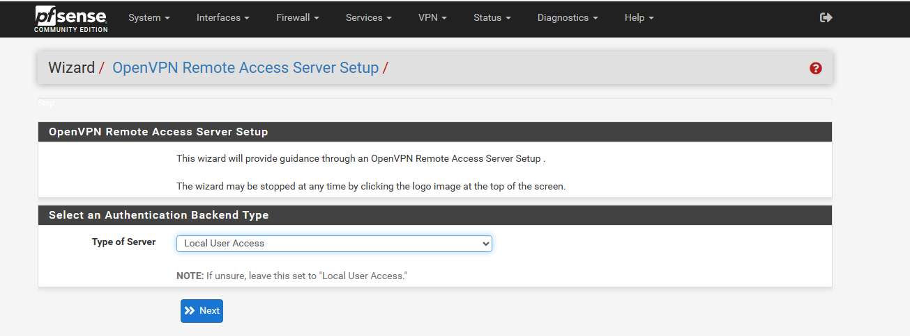
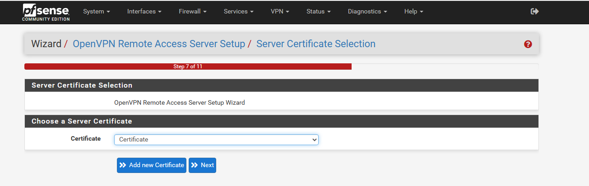
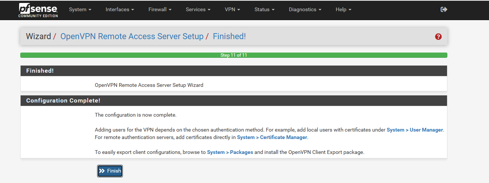
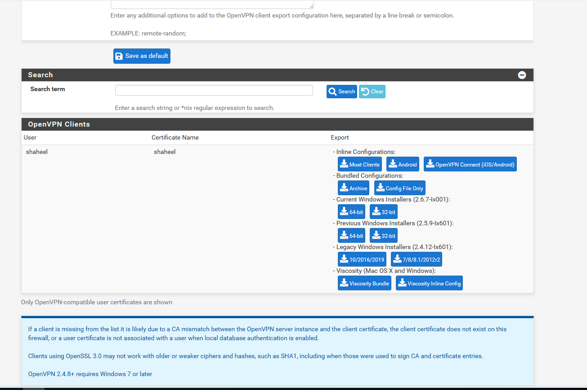

# Network Expansion for An Office

This project establishes a secure and efficient network infrastructure to enable remote workers to access organizational resources seamlessly. Leveraging Virtual Private Network (VPN) technology, robust firewall configurations, and VLAN-based segmentation, the system ensures secure communication and prevents unauthorized access. By integrating advanced cryptographic protocols and adhering to best practices in network security, the solution guarantees data confidentiality, integrity, and availability while supporting the operational needs of the organization.

Virtual Private Networks (VPNs) are integral to ensuring secure data transmission, especially for remote access scenarios or when connecting to public networks. A VPN creates a secure, encrypted tunnel between the user’s device and the VPN server, safeguarding data from interception or eavesdropping by unauthorized parties. This mechanism enhances the reliability and security of remote connections, making it a critical component of the modern network infrastructure.

## How the Network looks like

  

## Objective 

As the network administrator, my objective is to design and configure the VPN infrastructure to provide secure access for remote users. This includes implementing advanced security measures, configuring the pfSense firewall for VPN functionality, and ensuring that remote users can access the organization's internal resources without compromising network integrity or performance.

### Technology & Hardware Used:
This network infrastructure utilizes a combination of advanced technologies and hardware to ensure secure and efficient remote access to organizational resources.

#### - pfSense Firewall: An open-source platform serving as the central gateway for managing traffic, securing the network, and providing VPN functionality.
#### - OpenVPN: A robust VPN protocol that enables secure, encrypted connections for remote users, allowing access to internal organizational resources.
#### - Cryptographic Protocols: Utilization of advanced encryption standards (e.g., AES) and secure tunneling mechanisms to protect the confidentiality and integrity of data in transit.
#### - VLAN Segmentation: Network segmentation through Virtual Local Area Networks (VLANs) to isolate traffic, restrict access to sensitive resources, and improve overall network security.
### Hardware:
#### - Firewall Appliance: A dedicated device running pfSense, responsible for traffic management, VPN connection security, and enforcing firewall policies.
#### - Network Switches: Managed switches supporting VLANs for efficient internal traffic management and segmentation, ensuring optimal performance and security.
#### - End-User Devices: Devices (laptops, desktops) with OpenVPN client software installed, enabling remote users to securely connect to the network and access resources.

## Steps to Establish a VPN Connection for Remote Users
### 1. Set Up pfSense Firewall
Download and install pfSense on a dedicated machine or virtual appliance to function as the network's primary firewall.
Then Set up WAN (external) and LAN (internal) interfaces. The LAN interface will be used for VPN connections, while WAN interfaces handle incoming traffic from remote users.

### 2. Install OpenVPN on pfSense

  - Log in to the pfSense web interface.
  - Navigate to System > Package Manager > Available Packages.
  - Search for OpenVPN and click Install. This will install the OpenVPN package on pfSense.

  

### 3. Set Up OpenVPN Server

  - Navigate to VPN > OpenVPN.
  - Protocol: Select either UDP or TCP based on your preference.
  - Choose a port (default is 1194) for the OpenVPN server to listen on.

  
  
  
  

### 4. Configure Crpyotography & VPN Tunnel Network

  - Enable TLS Authentication for provide the key for enhanced security.
  - Select the server certificate you created earlier.
  - Tunnel Network: Specify a subnet (e.g., 172.20.10.0/24) for the VPN tunnel.
  - Local Network: Add the internal network(s) that remote users will have access to (e.g., 172.20.1.0/24).
  - If you want all remote traffic to route through the VPN, check this box.

  
  

### 5. Configure Firewall Rules

  - Navigate to Firewall > Rules > OpenVPN.
  - Add rules to allow incoming traffic on the OpenVPN port (1194 by default) and any other necessary traffic (e.g., to allow access to internal network resources).
  - Apply Changes: After adding rules, click Apply Changes (This Can be configured while configuring the VPN).

  
  

___

## Exporting OpenVPN 

### 1. Create OpenVPN Client Export Package

  - Navigate to System > Package Manager > Available Packages.
  - Install OpenVPN Client Export, This package allows for easy configuration and export of client configuration files.
  - After installation, go to VPN > OpenVPN > Client Export.
  - Select the user and export the configuration file. This file contains the settings necessary for client devices to connect to the VPN.

  
  

## Install OpenVPN Client on User Devices & Test the VPN Connection

  - Install the OpenVPN client on remote devices (available for Windows, macOS, Linux, Android, and iOS).
  - Ensure that the VPN connection is established successfully and that the remote user can access internal network resources.

  

___

